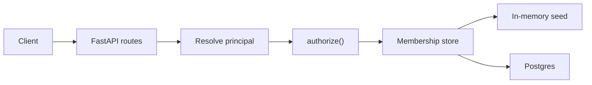

# stackai-authz

Authorization service for organizations, teams, users, and workflows.

**Identity answers who is acting. Authorization answers whether they may act.** The two never mix: a JWT, API key, or anonymous caller is resolved into a `Principal` first; a single `authorize(principal, action, resource)` function then returns allow or deny with a stable reason. Routes never branch on role.



---

## Quickstart

```bash
python3.13 -m venv .venv
.venv/bin/pip install -r requirements.txt
.venv/bin/fastapi dev src/main.py
```

Open [http://127.0.0.1:8000/docs](http://127.0.0.1:8000/docs). No database required — the process seeds an in-memory **Acme** org with demo teams, workflows, and API keys. On Windows, use WSL.

To run against real Postgres instead, see [Persistence](#persistence-supabase--postgres).

---

## The model

This is a small FastAPI API — an authorization layer, not a workflow runtime and not a signup product.

- **Users** are Supabase Auth subjects (`sub`). There is no `users.role` column.
- **Roles live on memberships.** `organization_members.role` and `team_members.role` carry the role — a person can be super-admin in one org and a viewer on a single team in another. A role is an attribute of a relationship, never of a user.
- **Org context is the URL.** `/orgs/{org_id}/...` names the active org. A token never implies "the user's only org."
- **Every org has a default team.** Org-shared work lives there. It cannot be deleted and its memberships cannot be removed directly — drop the org membership instead.
- **Execute is an authorization gate** plus a canned `{"status": "ok"}` body. There is no runner behind it.

### Where enforcement lives

`src/authz/` is the permission matrix and the single source of truth. It imports no FastAPI and no database SDK — memberships arrive through a `Protocol`, so the same engine runs against the in-memory seed, Postgres, or a test fake.

Postgres RLS is enabled default-deny on every exposed table, but it is **not** the authorization engine: the API connects with a role that carries `BYPASSRLS`, so policies never evaluate on this process's queries. RLS exists as a backstop for anything that is *not* this process — a leaked `anon` key hitting the auto-generated Data API sees nothing. The reasoning is in [`decisions.md`](decisions.md).

---

## Who may do what

**Org `member` has no org-admin powers** — they act through team membership (including the default team). **Team roles nest: admin ⊃ editor ⊃ viewer.** Org super-admin bypasses team checks inside the engine, never in handlers.

| | Super-admin | Team admin | Editor | Viewer | Org member | API key | Anonymous |
| --- | :---: | :---: | :---: | :---: | :---: | :---: | :---: |
| Create / delete team | yes | | | | | | |
| Add / change / remove **org** members | yes | | | | | | |
| Add / change / remove **team** members | yes | yes | | | | | |
| Create / update / delete workflow | yes | yes | yes | | | | |
| Execute workflow | yes | yes | yes | yes | | yes* | |
| List workflows in the org | yes | yes | yes | yes | yes | yes* | |
| Execute **exported** workflow | by visibility | by visibility | by visibility | by visibility | by visibility | public / password only | public / password only |
| List **own** orgs / teams | yes | yes | yes | yes | yes | | |

\* API keys are org-scoped: they may list and execute workflows in **their** org only. They may never create teams, mutate memberships, delete workflows, or reach org-only exports.

**Self-service is read-only.** Callers may list their own orgs and teams, but cannot add themselves, change their own role, or leave. An org super-admin may list anyone's teams *in that org*; listing another user's orgs is denied — it would leak memberships in other orgs. There is no platform-wide admin.

### Workflow visibility

Workflow `visibility` is `team | public | password | org`:

| Visibility | Who can `POST .../execute-exported` |
| --- | --- |
| `team` | Nobody via export — use `POST .../execute` as a team member. |
| `public` | Anyone, no auth. |
| `password` | Anyone who posts `{"password": "..."}`. A password is not a session. |
| `org` | A **user** who is a member of that org. Not anonymous, not an API key. |

`GET /workflows` is org-gated, then filtered: `visibility=team` workflows are hidden unless the caller is on that team. Super-admin sees every workflow in the org.

---

## HTTP contract

| Method | Path |
| --- | --- |
| `POST` | `/orgs` |
| `POST` `GET` | `/orgs/{org_id}/teams` |
| `DELETE` | `/orgs/{org_id}/teams/{team_id}` |
| `POST` `DELETE` `PATCH` | `/orgs/{org_id}/teams/{team_id}/members/{user_id}` |
| `POST` `DELETE` `PATCH` | `/orgs/{org_id}/members/{user_id}` |
| `GET` | `/orgs/{org_id}/members/{user_id}/teams` |
| `GET` | `/users/{user_id}/orgs` |
| `GET` `POST` | `/orgs/{org_id}/workflows` |
| `PUT` `DELETE` | `/orgs/{org_id}/workflows/{workflow_id}` |
| `POST` | `/orgs/{org_id}/workflows/{workflow_id}/execute` |
| `POST` | `/orgs/{org_id}/workflows/{workflow_id}/execute-exported` |

**Status codes.** Creates `201` · PUT/PATCH `200` · deletes `204` · invalid UUID `422` · unknown resource `404` · conflict `409` · missing or bad credentials `401` · authenticated-but-denied `403` with `{"error": "forbidden", "reason": "..."}`.

**Authentication.** User calls send `Authorization: Bearer <access_token>` from Supabase Auth, verified via JWKS (ES256/RS256 — not the legacy HS256 shared secret). Workflow routes also accept `X-Api-Key`; when both are present, the API key wins.

**Notes.** `POST /orgs` is self-serve: any authenticated user becomes that org’s `super_admin` (and default-team `admin`). `POST /workflows` is create-only; `PUT` replaces the workflow. Role changes are `PATCH`. API keys are seeded (no create-key route).

---

## Try it

Seeded Acme org (identical in-memory and in the cloud seed):

| | UUID |
| --- | --- |
| Org | `00000000-0000-0000-0000-00000000000a` |
| Engineering team | `00000000-0000-0000-0000-0000000000a1` |
| Team workflow | `00000000-0000-0000-0000-0000000000f1` |
| Public export | `00000000-0000-0000-0000-0000000000f2` |
| Password export | `00000000-0000-0000-0000-0000000000f3` |
| Org-only export | `00000000-0000-0000-0000-0000000000f4` |

Demo API keys (not production secrets):

| Org | Header |
| --- | --- |
| Acme | `X-Api-Key: sak_demo_acme_aaaaaaaaaaaaaaaaaaaaaaaaaaaa` |
| Other Org | `X-Api-Key: sak_demo_other_bbbbbbbbbbbbbbbbbbbbbbbbbbbb` |

```bash
ORG=00000000-0000-0000-0000-00000000000a
PUB=00000000-0000-0000-0000-0000000000f2
TEAM=00000000-0000-0000-0000-0000000000f1
PASS=00000000-0000-0000-0000-0000000000f3

# Anonymous cannot list teams
curl -i http://127.0.0.1:8000/orgs/$ORG/teams
# 403  {"error":"forbidden","reason":"anonymous_denied"}

# Public export needs no auth
curl -s -X POST http://127.0.0.1:8000/orgs/$ORG/workflows/$PUB/execute-exported
# {"status":"ok","workflow_id":"...f2"}

# Team visibility is not an export
curl -s -X POST http://127.0.0.1:8000/orgs/$ORG/workflows/$TEAM/execute-exported
# {"error":"forbidden","reason":"export_not_permitted"}

# Password export
curl -s -X POST http://127.0.0.1:8000/orgs/$ORG/workflows/$PASS/execute-exported \
  -H 'Content-Type: application/json' \
  -d '{"password":"export-secret"}'

# API key may list and execute in its org — never create teams
curl -s http://127.0.0.1:8000/orgs/$ORG/workflows \
  -H 'X-Api-Key: sak_demo_acme_aaaaaaaaaaaaaaaaaaaaaaaaaaaa'

# A malformed Bearer token is unauthenticated, not anonymous
curl -i http://127.0.0.1:8000/orgs/$ORG/teams \
  -H 'Authorization: Bearer not-a-jwt'
# 401  {"error":"unauthenticated"}
```

Interactive docs: [http://127.0.0.1:8000/docs](http://127.0.0.1:8000/docs).

---

## Persistence (Supabase + Postgres)

Copy [`.env.example`](.env.example) to `.env` (gitignored).

| Variable | Purpose |
| --- | --- |
| `APP_SUPABASE_URL` | Project URL. JWKS at `/auth/v1/.well-known/jwks.json`; issuer `https://<ref>.supabase.co/auth/v1`. |
| `APP_DATABASE_URL` | Postgres DSN, `sslmode=require`. Use the **IPv4 session pooler** (`postgres.<ref>@aws-0-<region>.pooler.supabase.com:5432`). |
| `APP_JWT_AUDIENCE` | Defaults to `authenticated`. |
| `APP_DEBUG` | Local lab only. Defaults to `false`. |

With `APP_DATABASE_URL` set, memberships and resources load from Postgres; without it, the in-memory store is used. Either way, authorization runs in Python — the API connects as `postgres` (`BYPASSRLS`) for every request, including anonymous export.

Setup: apply schema from [`supabase/migrations/`](supabase/migrations/), seed users in the Auth dashboard (there is no signup route). The seed migration attaches the oldest Auth user as Acme super-admin.

---

## Tests

```bash
.venv/bin/python -m pytest
.venv/bin/python -m ruff check src tests
```

- **The bar:** a parametrized `authorize()` matrix ([`tests/test_authorize.py`](tests/test_authorize.py)) against the in-memory store — every action, for user / API key / anonymous principals, allow and deny.
- **Smoke, not proof:** [`tests/test_smoke.py`](tests/test_smoke.py) exists so HTTP wiring cannot silently break. It is not the authorization bar.
- Live Postgres / Data API checks are skipped unless `RUN_LIVE_DB=1`.

Unit tests always inject the in-memory store; they never touch Postgres.

---

## Docker

```bash
docker compose up --build
```

The image contains no secrets — Compose forwards host env at runtime and forces `APP_DEBUG=false`.

- No `.env` → in-memory demo at [http://127.0.0.1:8000/docs](http://127.0.0.1:8000/docs)
- `.env` present → same container against your cloud project (JWKS + pooler)

---

## Debug UI (local only)

When `APP_DEBUG=true`, [http://127.0.0.1:8000/debug](http://127.0.0.1:8000/debug) lists orgs, teams, users, and workflows; its buttons call the **real** API. Identity is `X-Debug-User: <user uuid>` (no JWKS private key needed) or a seeded `X-Api-Key`.

```bash
APP_DEBUG=true .venv/bin/fastapi dev src/main.py
```

Not part of the HTTP contract. Never enable in Compose or production.

---

## Layout

```
src/authn/     JWT (JWKS) and API-key principal resolution
src/authz/     authorize(), models, in-memory + Postgres stores
src/orgs/      org memberships, list-own-orgs
src/teams/     teams and team memberships
src/workflows/ workflows, execute, exported execute
src/debug/     local lab UI — mounted only if APP_DEBUG=true
```

Routers adapt HTTP. Services persist. `authz/` decides. Cross-package imports use the package name (`from src.authz import engine as authz_engine`).

Design docs: [`SPEC.md`](SPEC.md) (phases, HTTP contract, assumptions) · [`decisions.md`](decisions.md) (why).

---

## Out of scope / known limits

- No signup UI, email, or local Supabase stack.
- No workflow execution engine — execute is authorization plus a no-op body.
- No create-API-key route and no in-app key rotation; keys are seeded.
- No audit table, no custom JWT TTL hook — access-token lifetime is whatever the Auth project sets.
- The FastAPI process uses a Postgres role with `BYPASSRLS`, so RLS never evaluates on its queries. It is enabled anyway so `anon`/`authenticated` stay default-deny if the Data API is ever pointed at these tables.
- No Casbin/OPA, no SAML, no `users.role`.
