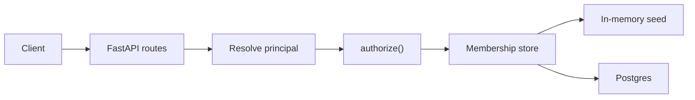

# stackai-authz

Authorization for organizations, teams, users, and workflows.

Identity answers **who is acting**. Authorization answers **whether they may do it**. Those stay separate: a JWT, API key, or anonymous caller is resolved first; a single `authorize()` function then returns allow or deny with a stable reason.

```bash
python3.13 -m venv .venv
.venv/bin/pip install -r requirements.txt
.venv/bin/fastapi dev src/main.py
```

Open [http://127.0.0.1:8000/docs](http://127.0.0.1:8000/docs). No database is required for this path — the process seeds an in-memory Acme org, demo workflows, and API keys.

On Windows, run those commands in WSL.

---

## What this service does

This is a small FastAPI API, not a workflow runtime and not a signup product.

- **Users** are Supabase Auth subjects (`sub`). They have no `role` column.
- **Roles live on memberships**: `organization_members.role` and `team_members.role`. A person can be super-admin in one org and a viewer on one team in another.
- **Org context is the URL.** `/orgs/{org_id}/...` is the active org. A token never means “the user’s only org.”
- **Every org has a default team.** Org-shared work lives there. That team cannot be deleted, and its memberships cannot be removed (drop the org membership instead).
- **Execute is an AuthZ gate** plus a canned `{ "status": "ok" }` body. There is no runner behind it.



`src/authz/` is the permission matrix. Routes do not branch on role. RLS is enabled default-deny on every exposed table; it is a backstop for anything that is not this process, not a second copy of the matrix.

---

## Who may do what

**Org `member` has no org-admin powers.** They act through team membership (and the default org team). **Team admin includes editor; editor includes viewer.** Org super-admin bypasses team checks inside the engine, not in handlers.

| | Super-admin | Team admin | Editor | Viewer | Org member | API key | Anonymous |
| --- | :---: | :---: | :---: | :---: | :---: | :---: | :---: |
| Create / delete team | yes | | | | | | |
| Add / change / remove **org** members | yes | | | | | | |
| Add / change / remove **team** members | yes | yes | | | | | |
| Create / update / delete workflow | yes | yes | yes | | | | |
| Execute workflow | yes | yes | yes | yes | | yes* | |
| List workflows in the org | yes | yes | yes | yes | yes | yes* | |
| Execute **exported** workflow | by visibility | by visibility | by visibility | by visibility | by visibility | public / password only | public / password only |
| List **own** orgs / teams | yes | yes | yes | yes | yes | | |

\*API keys are org-scoped. They may list and execute workflows in **their** org. They may not create teams, mutate memberships, delete workflows, or hit org-only exports.

Callers cannot add themselves, change their own membership role, or leave. Listing is not mutation: you may list your own orgs and your own teams; an org super-admin may list anyone’s teams **in that org**. Listing another user’s orgs is denied (it would leak other-org memberships). There is no platform-wide admin.

Workflow visibility is `team | public | password | org`:

| Visibility | Who can `POST .../execute-exported` |
| --- | --- |
| `team` | Nobody via export. Use `POST .../execute` as a team member. |
| `public` | Anyone, no auth. |
| `password` | Anyone who posts `{ "password": "..." }`. A password is not a session. |
| `org` | A **user** who is a member of that org. Not anonymous, not an API key. |

`GET /workflows` is org-gated, then filtered: `visibility=team` workflows are hidden unless the caller is on that team (super-admin sees every workflow in the org).

---

## Try it

Seeded **Acme** org (in-memory, and in the cloud seed):

| | UUID |
| --- | --- |
| Org | `00000000-0000-0000-0000-00000000000a` |
| Engineering team | `00000000-0000-0000-0000-0000000000a1` |
| Team workflow | `00000000-0000-0000-0000-0000000000f1` |
| Public export | `00000000-0000-0000-0000-0000000000f2` |
| Password export | `00000000-0000-0000-0000-0000000000f3` |
| Org-only export | `00000000-0000-0000-0000-0000000000f4` |

Demo API keys (not production secrets):

| Org | Header |
| --- | --- |
| Acme | `X-Api-Key: sak_demo_acme_aaaaaaaaaaaaaaaaaaaaaaaaaaaa` |
| Other Org | `X-Api-Key: sak_demo_other_bbbbbbbbbbbbbbbbbbbbbbbbbbbb` |

```bash
ORG=00000000-0000-0000-0000-00000000000a
PUB=00000000-0000-0000-0000-0000000000f2
TEAM=00000000-0000-0000-0000-0000000000f1
PASS=00000000-0000-0000-0000-0000000000f3

# Anonymous cannot list teams
curl -i http://127.0.0.1:8000/orgs/$ORG/teams
# 403  {"error":"forbidden","reason":"anonymous_denied"}

# Public export needs no auth
curl -s -X POST http://127.0.0.1:8000/orgs/$ORG/workflows/$PUB/execute-exported
# {"status":"ok","workflow_id":"...f2"}

# Team visibility is not an export
curl -s -X POST http://127.0.0.1:8000/orgs/$ORG/workflows/$TEAM/execute-exported
# {"error":"forbidden","reason":"export_not_permitted"}

# Password export
curl -s -X POST http://127.0.0.1:8000/orgs/$ORG/workflows/$PASS/execute-exported \
  -H 'Content-Type: application/json' \
  -d '{"password":"export-secret"}'

# API key may list and execute in its org, not create teams
curl -s http://127.0.0.1:8000/orgs/$ORG/workflows \
  -H 'X-Api-Key: sak_demo_acme_aaaaaaaaaaaaaaaaaaaaaaaaaaaa'

# A malformed Bearer token is unauthenticated, not anonymous
curl -i http://127.0.0.1:8000/orgs/$ORG/teams \
  -H 'Authorization: Bearer not-a-jwt'
# 401  {"error":"unauthenticated"}
```

User calls take `Authorization: Bearer <access_token>` from Supabase Auth (ES256 / RS256 via JWKS — not the legacy HS256 JWT secret). `X-Api-Key`, when present, wins over `Authorization` on the same request.

Interactive docs: [http://127.0.0.1:8000/docs](http://127.0.0.1:8000/docs).

---

## HTTP

Creates `201`, PUT/PATCH `200`, deletes `204`. Invalid UUID `422`. Unknown resource `404`. Conflict `409`. Authenticated-but-denied `403` with `{ "error": "forbidden", "reason": "..." }`. Missing or bad credentials `401`.

| Method | Path |
| --- | --- |
| `POST` `GET` | `/orgs/{org_id}/teams` |
| `DELETE` | `/orgs/{org_id}/teams/{team_id}` |
| `POST` `DELETE` `PATCH` | `/orgs/{org_id}/teams/{team_id}/members/{user_id}` |
| `POST` `DELETE` `PATCH` | `/orgs/{org_id}/members/{user_id}` |
| `GET` | `/orgs/{org_id}/members/{user_id}/teams` |
| `GET` | `/users/{user_id}/orgs` |
| `GET` `POST` | `/orgs/{org_id}/workflows` |
| `PUT` `DELETE` | `/orgs/{org_id}/workflows/{workflow_id}` |
| `POST` | `/orgs/{org_id}/workflows/{workflow_id}/execute` |
| `POST` | `/orgs/{org_id}/workflows/{workflow_id}/execute-exported` |

`POST /workflows` is create only. `PUT` replaces the workflow (name, team, visibility, optional export password). Membership role changes are `PATCH`. There is no `POST /orgs` and no create-API-key route — orgs and keys are seeded.

---

## Persist to Postgres

Copy [`.env.example`](.env.example) to `.env` (gitignored).

| Variable | Purpose |
| --- | --- |
| `APP_SUPABASE_URL` | Project URL. JWKS at `/auth/v1/.well-known/jwks.json`. Issuer `https://<ref>.supabase.co/auth/v1`. |
| `APP_DATABASE_URL` | Postgres DSN, `sslmode=require`. Use the **IPv4 session pooler** (`postgres.<ref>@aws-0-<region>.pooler.supabase.com:5432`). |
| `APP_JWT_AUDIENCE` | Defaults to `authenticated`. |
| `APP_DEBUG` | Local lab only. Defaults to `false`. |

With `APP_DATABASE_URL` set, memberships and resources load from Postgres. The API connects as `postgres` (`BYPASSRLS`) for every request, including anonymous export. Authorization still runs in Python.

Apply schema from [`supabase/migrations/`](supabase/migrations/). Seed users in the Auth dashboard (no signup route). The seed migration attaches the oldest Auth user as Acme super-admin.

Without those env vars, the in-memory store is used. Unit tests always inject the in-memory store.

---

## Tests

```bash
.venv/bin/python -m pytest
.venv/bin/python -m ruff check src tests
```

Authorization is proven by a parametrized `authorize()` matrix (`tests/test_authorize.py`) against the in-memory store: every action, for user / API key / anonymous, allow and deny.

`tests/test_smoke.py` is **smoke, not proof**. It exists so HTTP wiring cannot silently break. It is not the AuthZ bar.

Live Postgres / Data API checks are skipped unless `RUN_LIVE_DB=1`.

---

## Docker

The image has no secrets. Compose forwards host env at runtime and forces `APP_DEBUG=false`.

```bash
docker compose up --build
```

- No `.env` → in-memory demo on [http://127.0.0.1:8000/docs](http://127.0.0.1:8000/docs)
- `.env` present → same container against your cloud project (JWKS + pooler)

---

## Debug UI (local only)

Not part of the HTTP contract. When `APP_DEBUG=true`, [http://127.0.0.1:8000/debug](http://127.0.0.1:8000/debug) lists orgs, teams, users, and workflows. Membership and workflow buttons call the **real** API. Identity is `X-Debug-User: <user uuid>` (no JWKS private key) or a seeded `X-Api-Key`.

```bash
APP_DEBUG=true .venv/bin/fastapi dev src/main.py
```

Do not enable `APP_DEBUG` in Compose or production.

---

## Layout

```
src/authn/     JWT (JWKS) and API-key principal
src/authz/     authorize(), models, in-memory + Postgres stores
src/orgs/      org memberships, list-own-orgs
src/teams/     teams and team memberships
src/workflows/ workflows, execute, exported execute
src/debug/     local lab UI — mounted only if APP_DEBUG=true
```

Routers adapt HTTP. Services persist. `authz/` decides. Cross-package imports use the package name (`from src.authz import engine as authz_engine`).

Design notes: [`SPEC.md`](SPEC.md) (phases, HTTP contract, assumptions), [`decisions.md`](decisions.md) (why).

---

## Out of scope / known limits

- No signup UI, email, or local Supabase stack.
- No workflow execution engine — execute is AuthZ plus a no-op body.
- No create-API-key HTTP route; keys are seeded. No in-app key rotation.
- No audit table and no custom JWT TTL hook. Access-token lifetime is whatever the Auth project is set to (asymmetric keys often use a short expiry).
- The FastAPI process uses a Postgres role with `BYPASSRLS`. RLS is not evaluated on those queries. Enable it anyway so `anon` / `authenticated` stay default-deny if the Data API is ever pointed at these tables.
- No Casbin/OPA, SAML, or `users.role`.
